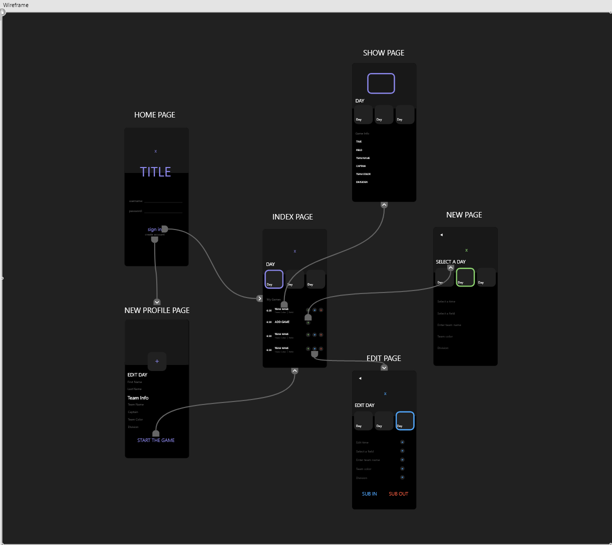
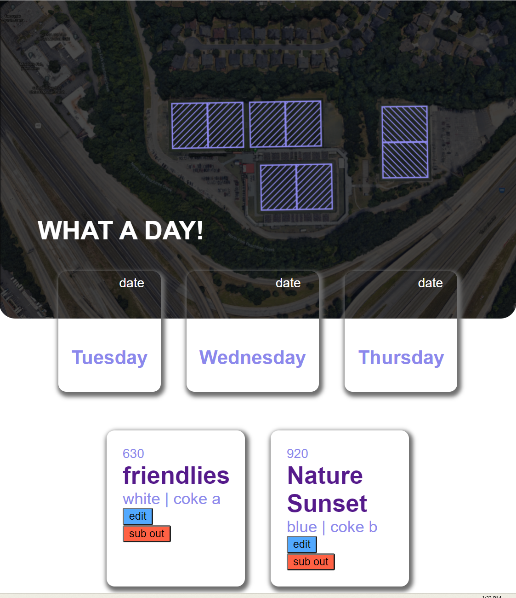

# <strong> Hello and Welcome </strong>
<strong> This is my PROJECT TWO for the SEIR Program. </strong>

Have a look around, I hope you enjoy.

Thank you, 
Vernell Miller

 

# <strong> KEEPME </strong>

Looking to level up your line-up? KEEPME is an idea that originates from my time playing soccer. Fortunately for me, I am able to play multiple positions on the field. This allows me to play for as many teams as I want. Unfortunately for me, I can't play for every team that wants me to play for them. KEEPME allows me or YOU to schedule me in your lineup. That way we can kEEP track of what games I can play.
Just enter a little bit of info on your team, time and place and we're ready to play.

# Technologies Used:

    - HTML
    - CSS
    - JavaScript
    - Express
    - EJS
    - LUCIDAPP
    - Adobe Illustrator
    - Adobe XD.

# Screenshots:

<strong> WIREFRAME </strong>

# Getting Started:

[Click here](https://vernellmiller.github.io/My-Top-Five/) to see the deployed project.

# Future Enhancements :
- Select a day and schedule games for that particular day.
- keep track of the days by adding the date.
- restrict certain functionalities for non registered users.